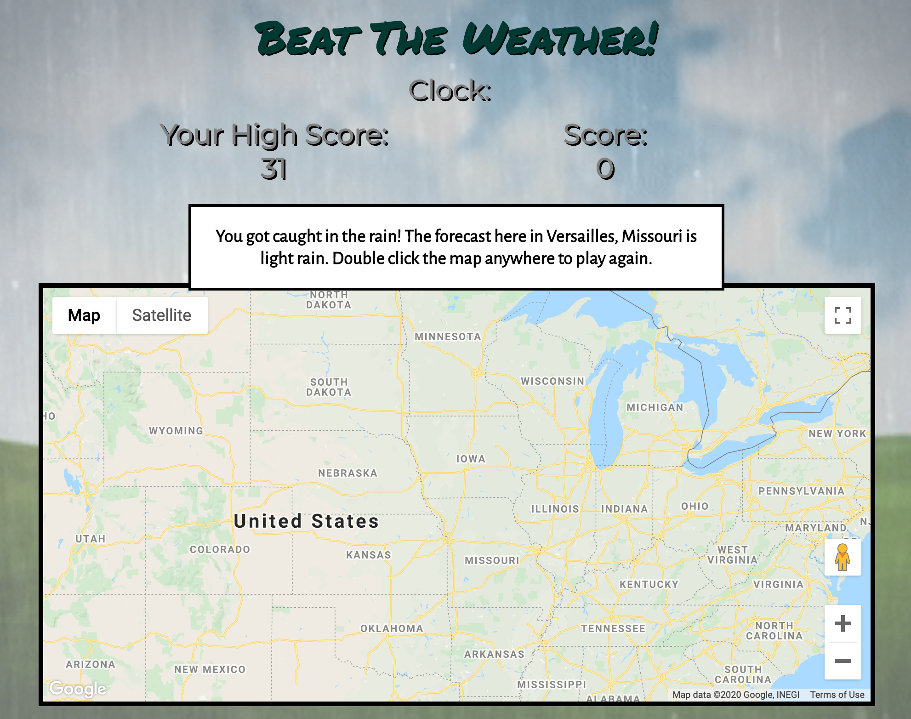

# Beat The Weather

Welcome to "Beat the Weather", a game that puts your memory and navigatory skills to the test!

Faced with a world map, randomly centered within the United States, players must navigate to and double click on a specified state within 10 seconds and without 
getting caught in bad weather (either heavy rain or a thunderstorm). The game utilized JavaScript, HTML5 and CSS3 and uses Google Maps API, LocationIQ, and OpenWeatherMap for up-to-date weather forecasts.

In "Beat The Weather," players are able to
  - play with a new, randomized series of states every round
  - receive visual feedback on navigation events, including 
    - double clicks on any area 
    - navigating to an area with "bad weather"
    - navigating to the wrong state or a location outside the United States
    - running out of time
  - receive real-time weather forecast information for any location
  - record their high score and have that data persist in the web browser




```
const tick = setInterval(function() {

  if (clock.textContent) clockLabel.style.display = "block";
  if (parseInt(clock.textContent) > 0 && loader.style.display === "none") {
    clock.textContent = parseInt(clock.textContent) - 1
  } else if (parseInt(clock.textContent) === 0) {
    runner.textContent = `You ran out of time! Double click the map anywhere to play again.`
    let currentScore = score.textContent;
    score.textContent = 0;
    targetState = undefined;
    updateStreak(currentScore);
    clock.textContent = "";
  }
}, 1000)

function getHighScore() {
  return localStorage.getItem('highScore') || '0';
}
```
